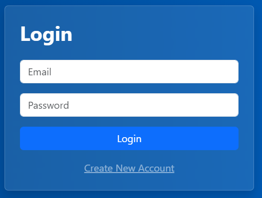
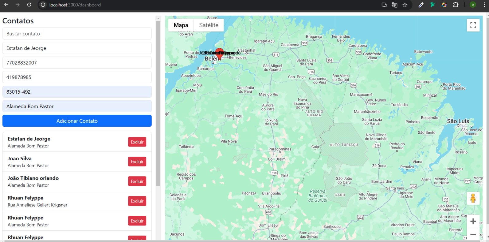

# Projeto Frontend - Gerenciamento de Contatos

Este projeto é um painel de gerenciamento de contatos integrado com o Google Maps. Ele possui funcionalidades de **login**, **cadastro de usuários** e uma tela principal para adicionar, listar, excluir contatos e visualizar suas localizações no mapa.

## 📋 Pré-requisitos

Antes de iniciar, certifique-se de ter instalado as seguintes ferramentas em sua máquina:

- [Node.js](https://nodejs.org/) (v14+)
- [NPM](https://www.npmjs.com/) ou [Yarn](https://yarnpkg.com/)

## 🚀 Instalação do Projeto

1. **Clone o repositório**:
   ```bash
   git clone https://github.com/seu-usuario/nome-do-repositorio.git
   cd nome-do-repositorio
Instale as dependências:

bash
Copiar código
npm install
# ou
yarn install
Configure as variáveis de ambiente:

Crie um arquivo .env na raiz do projeto com as seguintes variáveis:

bash
Copiar código
REACT_APP_API_URL=http://localhost:8000/api
REACT_APP_GOOGLE_MAPS_API_KEY=YOUR_GOOGLE_MAPS_API_KEY
Substitua YOUR_GOOGLE_MAPS_API_KEY pela chave da API do Google Maps.

Inicie o servidor de desenvolvimento:

bash
Copiar código
npm start
# ou
yarn start
Acesse o projeto:

O projeto estará disponível em: http://localhost:3000

🖥️ Funcionalidades do Projeto
Tela de Login:

Insira seu e-mail e senha.
Acesso ao painel de gerenciamento de contatos.

Tela de Cadastro de Usuário:

Criação de um novo usuário.

Dashboard de Contatos:

Adicionar, buscar e excluir contatos.
Visualizar a localização no Google Maps.

📂 Estrutura do Projeto
bash
Copiar código
src/
│
├── components/           # Componentes reutilizáveis
├── pages/                # Páginas principais (Login, Dashboard, Cadastro)
├── services/             # Configuração de APIs (Axios)
├── styles/               # Arquivos de estilo (CSS/SCSS)
├── App.js                # Componente principal
├── index.js              # Arquivo de inicialização
└── .env                  # Variáveis de ambiente
⚙️ Backend
O projeto frontend está configurado para consumir uma API REST. Para configurar o backend local, certifique-se de que a API está rodando em:

bash
Copiar código
http://localhost:8000/api
🤝 Contribuições
Contribuições são sempre bem-vindas! Sinta-se à vontade para abrir uma issue ou um pull request.

📷 Prévia do Projeto
Login:


Cadastro:


Dashboard:



🛠️ Tecnologias Utilizadas
React.js
Axios
Google Maps API
Bootstrap
CSS/SCSS
🧑‍💻 Autor
Seu Nome - Seu LinkedIn
GitHub - Seu GitHub
📝 Licença
Este projeto está licenciado sob a MIT License. Consulte o arquivo LICENSE para mais informações.

markdown
Copiar código

### Imagens:
Certifique-se de salvar as imagens fornecidas nos seguintes caminhos:

1. **Login**: `./docs/login.png`
2. **Cadastro**: `./docs/create-account.png`
3. **Dashboard**: `./docs/dashboard.png`

Se precisar de mais alguma modificação ou ajuste, estou à disposição! 😊


Você disse:
preciso de um unico arquivo readme contendo o passo a passo de rodra o projeto
O ChatGPT disse:
ChatGPT
Aqui está o arquivo README.md finalizado e simplificado, contendo todos os passos necessários para rodar o projeto. Esse conteúdo está pronto para ser copiado e colado no seu projeto.

markdown
Copiar código
# 📌 Gerenciamento de Contatos com Google Maps

Este projeto é um **painel de gerenciamento de contatos** que permite adicionar, listar, excluir contatos e visualizar suas localizações no **Google Maps**. Ele inclui funcionalidades de login, cadastro de usuários e painel principal.

---

## 🚀 Passo a Passo para Rodar o Projeto

### 1. **Pré-requisitos**

Certifique-se de ter instalado na sua máquina:

- **Node.js** (v14+)
- **NPM** (ou **Yarn**)
- **Google Maps API Key** (obtenha a chave em [Google Cloud](https://console.cloud.google.com/))

---

### 2. **Clonar o Repositório**

Abra o terminal e execute:

```bash
git clone https://github.com/seu-usuario/nome-do-repositorio.git
cd nome-do-repositorio
3. Instalar Dependências
Execute o seguinte comando para instalar as dependências do projeto:

bash
Copiar código
npm install
# ou, se preferir usar Yarn
yarn install
4. Configurar Variáveis de Ambiente
Crie um arquivo .env na raiz do projeto com as seguintes variáveis:

bash
Copiar código
REACT_APP_API_URL=http://localhost:8000/api
REACT_APP_GOOGLE_MAPS_API_KEY=YOUR_GOOGLE_MAPS_API_KEY
Substitua YOUR_GOOGLE_MAPS_API_KEY pela chave da API do Google Maps.
Certifique-se de que o backend esteja rodando em http://localhost:8000/api.
5. Rodar o Projeto
Inicie o servidor de desenvolvimento com:

bash
Copiar código
npm start
# ou
yarn start
6. Acessar o Projeto
Abra o navegador e acesse:


Copiar código
http://localhost:3000
🖥️ Prévia do Projeto
Tela de Login

Tela de Cadastro

Dashboard de Contatos

🛠️ Tecnologias Utilizadas
React.js - Biblioteca principal para a interface.
Axios - Consumo da API REST.
Google Maps API - Exibição do mapa com marcadores.
Bootstrap - Estilização e layout responsivo.
📂 Estrutura do Projeto
bash
Copiar código
src/
│
├── components/           # Componentes reutilizáveis
├── pages/                # Páginas (Login, Cadastro, Dashboard)
├── services/             # Configuração do Axios
├── styles/               # Estilos globais (CSS/SCSS)
├── App.js                # Componente principal
├── index.js              # Inicialização do projeto
└── .env                  # Variáveis de ambiente
⚙️ Backend
O projeto depende de uma API REST que deve estar configurada para rodar localmente em http://localhost:8000/api.

Desenvolvido por [Airton Franco] - GitHub

yaml
Copiar código

---

### **Instruções sobre as Imagens**
1. Salve as imagens fornecidas na pasta **docs** dentro do seu projeto.
2. Estrutura recomendada:
docs/ ├── login.png ├── create-account.png └── dashboard.png

csharp
Copiar código

Esse arquivo inclui todas as instruções necessárias para configurar e rodar o projeto pela primeira vez, além de uma prévia visual com as imagens correspondentes. Se precisar de mais alguma alteração, é só avisar! 🚀


